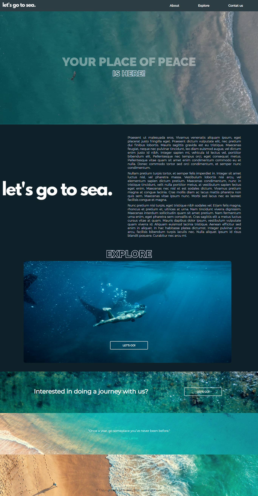

## Let's go to sea.

> A [Let's go to sea.](https://saaabreu.github.io/EstartandoDEVs-DevWeb/DesafioCSS1/) é uma plataforma que tem como objetivo levar a melhor experiencia em mar, para todos.
>> Desenvolvido como desafio de CSS, na segunda semana de aula de Desenvolvimento Web do [Estartando DEVs](https://estartandodevs.com.br/).
>>> escolha livre do design e conteúdo

